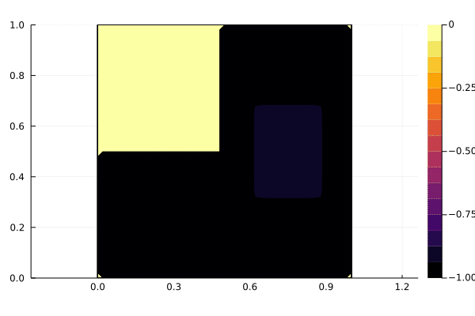

## MAM4 - EDP1
# Équations aux dérivées partielles 1
# 2023-24

[Discussions](https://github.com/pns-mam/edp1/discussions/1)

[TD 6 - Équation des ondes](td6/td6.pdf)
([corrigé](td6/td6-corr.pdf))

[TD 7 - Formule de Green et applications](td7/td7.pdf)
([corrigé](td7/td7-corr.pdf))

[TD 8 - Formulation variationnelle](td8/td8.pdf)
([corrigé](td8/td8-corr.pdf))

[TP 1 - Advection](advection/advection.ipynb)
([corrigé](advection/advection-corr.ipynb))

[TP 2 - Équation de la chaleur](heat/heat.ipynb)
([notes de cours](heat/heat.pdf))
([corrigé](heat/heat-corr.ipynb))

[Exam CC 1](exam-cc1/exam-cc1.pdf)
([corrigé](exam-cc1/exam-cc1-corr.pdf))

[Exam CC 2](exam-cc2/exam-cc2.md)

[Exam CC 2 2022-23](exam-cc2-old/exam-cc2.pdf)
([corrigé](exam-cc2-old/exam-cc2-corr.pdf))

# Bibliographie
[Allaire, G. Approximation numérique et optimisation. École Polytechnique, 2019. cel-02168288](https://hal.science/cel-02168288/document)

# Évaluation
2 exams CC (tous coeff. 1) et une note de TP

# Organisation
- 12 séances de CM
- 12 séances de TD

# Intervenants
- [V. Dolean](mailto:victorita.dolean@univ-cotedazur.fr) (CM et TD)
- [A. Habbal](mailto:abderrahmane.habbal@univ-cotedazur.fr) (TD)
- [J.-B. Caillau](mailto:jean-baptiste.caillau@univ-cotedazur.fr) (CM et TD)
